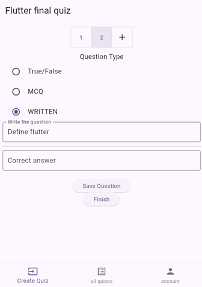

# Quizify

**Quizify** is a modern online quiz app designed for teachers to create interactive quizzes and for students to participate seamlessly.

## Overview  
Quizify began as a project for the *Mobile Application Development* course (ITCS444) at the University of Bahrain in November 2024. Now, the team is working to enhance it and transform it into a fully-featured application.

## Screenshots

Here are some screenshots showcasing the key features of **Quizify**:

### 1. All Quizzes
  
*View and manage all quizzes available in the app.*

### 1. Create Quiz
  
*Create a new quiz by entering details such as name, duration, and questions.*

### 1. Create Multiple Choice Question (MCQ)
  
*Create a multiple choice question for the quiz.*

### 1. Insert Quiz
  
*Take a quiz by its ID.*

### 1. View Results
  
*View the results after completing the quiz.*

### 1. Create Question
  
*Add various types of questions (True/False, MCQ, Written) to the quiz.*

### 1. Take Quiz
  
*Students can take quizzes by entering a unique quiz code.*

## Features  

- **User Authentication**: Secure sign-up and login for both teachers and students.  
- **Join Quizzes**: Students can easily join quizzes using a unique quiz code.  
- **Question Types**:  
  - **True/False**  
  - **Multiple Choice Questions (MCQs)**  
  - **Written Questions**  
- **Auto-Grading**: True/False and MCQs are graded automatically, reducing workload for instructors.  
- **Real-Time Feedback**: Students and teachers can view grades immediately after the quiz concludes.  
- **Timed Quizzes**: Quizzes include a due date and auto-submit when time runs out, ensuring fair participation.  

## Technology Stack  

- **Frontend**: Built with Flutter for a seamless cross-platform experience.  
- **Backend**: Powered by Firebase for reliable and scalable functionality.  

## Upcoming Features  

Although Quizify is already packed with useful features, it is still in the alpha stage. Planned improvements include:  

1. **Flexible Timing**: Allow quizzes without specific time constraints.  
2. **Manual Grading Interface**: Introduce a dedicated screen for instructors to grade written answers.  
3. **Classroom Integration**: Add support for creating and managing classrooms, allowing students to join and participate in specific groups.  
4. **Teacher Accounts**: Enable teacher-only accounts for a more tailored experience.  

## Authors  

This project was developed by a dedicated team of University of Bahrain students:  

- **Ahmed Khamdan** (Project Leader) - [@codemanbh](https://github.com/codemanbh)  
- **Ali Nusaif** - [@Whisperdam](https://github.com/Whisperdam)  
- **Qassim Alderazi** - [@Alderazi](https://github.com/Alderazi)  
- **Ebrahim Husain** - [@Ebraali2003](https://github.com/Ebraali2003)  

